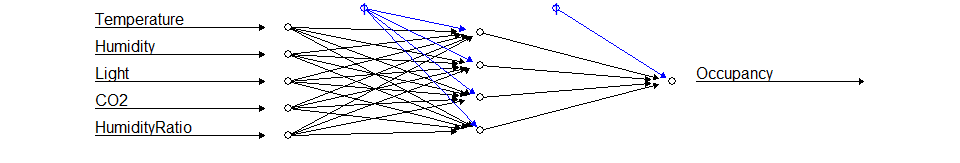
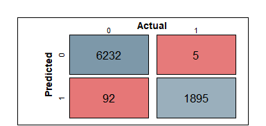

# Neural Network: Predicting room occupancy 

# 1 Introduction

Smart thermostats are developed to measure different metrics to asses
whether someone is occupying an office space. In this way, the
thermostat can suspend heating/cooling if the space is not occupied in
order to reduce energy waste. To provide this comfort, a machine
learning model has to be built. Therefore, this analysis addresses the
following: *How can the occupancy of a room be predicted using a neural
network?*

# 2 Data

The data contains 20,560 observations of different measurements in the
office space and an indication whether the room was occupied by someone
at the time. The provided measurements are as follows: temperature in
Celsius, humidity in percentages, light intensity in Lux, CO2 in parts
per million, and humidity ratio in kg of watervapor per kg of air.

# 3 Methodology

To predict whether predict whether someone is occupying the room, a
feed-forward neural network is constructed. The data is randomly divided
into a training (60%) and test (40%) set to construct and evaluate the
model. Also, the data is normalized by scaling the values between a
range of 0 to 1.

Heaton (2008) suggests that for many practical problems, the use of one
hidden layer is sufficient, and the amount of neurons to use in the
hidden layer to be $\\frac{2}{3}$ the size of the input layer, plus the
size of the output layer. Therefore, the neural network model in this
analysis is created using a single hidden layer, with *K* = 4 hidden
neurons, and *p* = 5 predictors. The model has the form

where *β*0 is the bias value of the output neuron,
*β**k* the weight corresponding to the synapse starting at
the *k*th hidden neuron and leading to the output neuron, *g*(*z*) is a
nonlinear activation function, *w**k*0 the bias value of the
*k*th hidden neuron, *w**k**j* the weights corresponding to
the the synapses leading to the *k*th hidden neuron, *X**j*
represents the *j*th predictor, *k* = 1,…, *K*, and *j* = 1,…, *p*. As
we are dealing with a binary classification, a sigmoid activation
function is used:

The training process consists of determining the bias and weight
parameters between the neurons by minimizing the cross entropy error
using the resilient backpropagation algorithm (Günther and Fritsch
2010).

# 4 Results

Final neural network.

Figure @ref(fig:nn) shows a visualization of the built neural network
model with 6 neurons (5 predictors + 1 bias) in the input layer, a
single hidden layer with 5 (4 + 1 bias) neurons, and one neuron in the
output layer.

Figure 1: Confusion matrix of predictions on test data.

Figure 1 shows the confusion matrix after making predictions
on the test data. The accuracy, sensitivity, specificity, precision,
balanced accuracy, and Kappa of the predictions made on the test data
are 0.9882, 0.9974, 0.9855, 0.9537, 0.9914, and 0.9673, repectively.
Predictions made on the train set produce similar results, therefore,
the model seems not to have overfit. High sensitivity is preferred as it
is unpleasant to have the thermostat automatically turn off
heating/cooling while the room is still occupied. The evaluated metrics
suggests that the neural network model is able to predict whether a
office is occupied with high accuracy even though the data is
imbalanced.

# 5 Conclusion & Discussion

In this analyis, predictions on whether an office space is occupied
based on measurements from a smart thermostat are made. The results
suggest that the neural network model is able to predict with high
accuracy and sensitivity.

As the data provided was not that big, in terms of observations and
dimensions, training a tree-based model for this case might have
produced similar or better results at a faster speed.

# 6 References

Günther, Frauke, and Stefan Fritsch. 2010. “Neuralnet: Training of
Neural Networks.” *R J.* 2 (1): 30.

Heaton, Jeff. 2008. *Introduction to Neural Networks with Java*. Heaton
Research, Inc.

